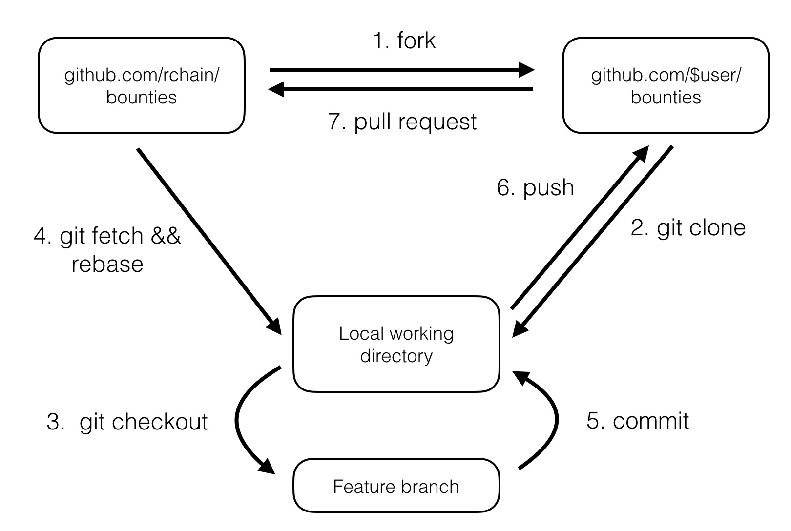

# 如何参与Rchain项目

很高兴您能阅读到这份文档，RChain真的非常需要活跃的开发者来帮助我们实现这个项目.

我们正在为贡献者建立一个社区流程，贡献者能够通过这个流程提交他们的工作，并且赚取RHOC代币。

读者可以观看[24:06 HJ explains Members Decentralized Budgeting](https://www.youtube.com/watch?v=7Li4g4qDF6M&t=1486s)以及[RChain, Decentralized budgeting and spending](https://www.youtube.com/watch?v=m6xiTWbEdpA)这两个视频来进一步了解这个工作流程。

我们热烈欢迎每一位贡献者参与我们的工作。 贡献的形式不单单只有提交代码， 还有很多不同的方式，包括社区活动，市场营销，业务发展，设计和治理。

### 社区交流

[RChain](https://rchain.coop) 拥有多个交流渠道，使得不断成长的社区内的成员可以轻松地进行沟通。[FAQ](https://github.com/rchain/reference/blob/master/faq.md)中有完整的通讯频道列表，而这些都是协作频道：

- 我们通过 [Github/RChain/Members](https://github.com/rchain/Members)项目进行工作协作以及状态更新。
- 我们正在尝试使用 [Mattermost](https://rchain.divvydao.net/community/channels/town-square) 和[Gitter](https://gitter.im/rchain/Rholang)来追溯有关谁在什么时间出于什么原因正在进行什么工作。
- 我们建立了一个电报聊天组(https://t.me/rchain_coop)供RChain的贡献者及爱好者进行交流，而所有官方的信息会由[RChain官方公告群](https://t.me/rchain_official)进行发布。 此外我们特意建立了一个[RChain官方中文聊天组](https://t.me/RChain_Official_Chat_CN)以及一个QQ群供中文爱好者进行交流。QQ群号为530718666。
- 我们已经从[Slack](https://ourchain.slack.com/messages?)迁移到了[Discord](https://discord.gg/fvY8qhx)。Discord有许多不同的聊天群组分别用来讨论不同的事情（请查看[如何成为一个RChain的成员](#如何成为一个RChain的成员)这一章节加入Discord群组）。这样做的目的是为了能够在[Github/Members](https://github.com/rchain/Members/) 中创建一些可执行的Issue来交由社区完成。
- 我们将不同的环境桥接在一起。因此你会收到例如Mattermost，Telegram，Gitter或Discord中的消息。
- 我们使用 [Google Groups](https://groups.google.com/forum/#!forum/rchain) 通过电子邮件进行信息交互，使用RChain Google云端硬盘进行文档的访问。
- 每周我们都会发起电话会议并且将会议视频上传到 [Youtube](https://www.youtube.com/channel/UCSS3jCffMiz574_q64Ukj_w)上。
- 每星期下午6点（阿姆斯特丹+1，纽约-5，西雅图-8，北京+8）我们都会发起一个[Member zoom meeting](https://zoom.us/s/197490909)，讨论需要解决的问题。
- 我们的[官方网站](https://rchain.coop)

### 协作方式

社区的爱好者都能够通过[Github/Members](https://github.com/rchain/Members/) 来创建Issue。我们通过这种社区去中心化以及自治的方法来实现RChain社区的运行。 每一位贡献者可以通过他们所掌握的技能和常识来解决Issue中的问题，并且凭此可以得到合理数量的RHOC代币作为奖励。

- 所有的工作任务都通过 [issues](https://github.com/rchain/Members/issues/)进行发布。
- 为了发布一个新的工作任务，或者参与某个工作任务，您需要首先完成以下工作:

  1. [ ] 申请一个[Github账号](https://github.com/rchain/Members)
  2. [ ] 通过上述交流渠道向@lapin7申请获得协作者权限，或者向[ops@rchain.coop](ops@rchain.coop)发送邮件进行权限申请
  3. [ ] 确认[rchain/Members](https://github.com/rchain/Members)项目的协作者邀请
  4. [ ] 成为rchain@googlegroups.com 的[会员](https://groups.google.com/forum/#!pendingmember/rchain/join)来访问我们的文档

- 以下这点并不是强制性的，但是完成这一步将有助于您：您可以选择成为RChain的会员，且在Discord上得到身份的验证。在这步中需要您交纳20刀的会员费进行身份验证，详情可见[如何成为一个RChain的成员](#如何成为一个RChain的成员)这一章节。

  1. [ ] 

     ​


#### 去中心化的工作预算申请机制
- 每一项工作的预算都将至少由三名成员来进行决定，最终的工作预算将取三位成员建议值的平均值

- @lapin7, HJ 在[RChain, Decentralized budgeting and spending](https://www.youtube.com/watch?v=m6xiTWbEdpA)视频中详细介绍了这种申请工作预算的工作方式

- RChain成员将对每一项工作提出一个预算的建议值.

- 所有的工作预算都被记录在[Pub Member Budget Allocation-Spending](https://docs.google.com/spreadsheets/d/1uxuxx8YN17KCIWcH1cUoGuSm2hAnIya2iAc6wxoaq1o/edit#gid=634479823) 这个工作表格中。你可以点击“Budget 201711”栏目来查看2017年11月工作预算的详细情况。

  

- 寻找你期望要申请工作预算的工作任务，例如#115 "Community Co-Operators"

- 在黄色栏中输入你的github用户名，例如lapin7

- 输入你对于这项工作预算的建议值，例如5000刀，您会看到在K66这个单元格中，当前工作预算变成了5000刀。它会将该预算累加至上个月的预算中。

  

- 运营负责人([ops@rchain.coop](ops@rchain.coop)) 可以通过电子邮件的方式在单元格中添加注释来激励工作预算

### 去中心化的报酬申请机制

- 我们将按照发票（单据）按月分发RHOC代币作为工作报酬。

- 在本月内每个合作者将决定以哪种方式将RHOC代币分配给合作者，以作为参与社区工作的奖励。 每一位合作者可以得到的工作报酬即为三个报酬金额建议值的平均值。

- 所有的工作预算都被记录在[Pub Member Budget Allocation-Spending](https://docs.google.com/spreadsheets/d/1uxuxx8YN17KCIWcH1cUoGuSm2hAnIya2iAc6wxoaq1o/edit#gid=634479823) 这个工作表格中。你可以点击“Reward 201711”栏目来查看2017年11月工作报酬的详细情况。

  

- 在Q栏和R栏中会分别显示这项工作被该成员完成的百分比，以及该成员的Github用户名。该成员以及同一任务的协作者都可以根据该成员完成工作的情况进行工作评分。

- 在M列中，您可以输入您的github名称，之后您的名字将出现在Q列中。

- 在R列中，您可以设置自己和其他合作者完成工作的百分比。

- 运营负责人([ops@rchain.coop](ops@rchain.coop)) 可以通过电子邮件的方式在单元格中添加注释来激励工作预算

#### 中心化的支付流程

- 每月的月底，所有的工作情况都会被冻结，预算或者报酬都不能被做任何修改。下个月月初将会开始报酬的支付工作。
- 合作者将会收到一封电子邮件，其中包含预先填好的发票信息以及合作者希望开出的属于自己发票上所需要填写的数据。 合作者需要将预先填好的发票的PDF版本或者自己的发票存储在他/她个人的[Gdrive of Rchain](https://drive.google.com/drive/folders/0B5I9qM5f_1cfeUZoV01EYjdmOEE)中。
- 之后合作者需要通过电子邮件向invoices@rchain.coop发送与其相关的PDF发票链接。
- 如果该成员每个月都有工作贡献，那么就可以建立一份工作说明书。 很快这个过程就可以被使用了。
- 如果这个过程运作良好，之后将按照工作区域或者地区进行去中心化的改进。

#### 税费
- RChain Coop必须遵守IRS的税收规定，这意味着在年底RChain必须提供对贡献者的支付清单，其数额通过表格1099进行记录。
- 如果贡献者的年收入超过600美元，则必须填写[Fw9纳税表](https://www.irs.gov/pub/irs-pdf/fw9.pdf)并将其存储在[个人文件夹Tax](https://drive.google.com/drive/folders/0B5I9qM5f_1cfeUZoV01EYjdmOEE)中。
- 对于居住在美国以外的贡献者，必须填写[Fw4税表](https://www.irs.gov/pub/irs-pdf/fw4.pdf)（仅1,2,3,4和7行）。
- 一旦[运营经理](ops@rchain.coop)得到通知，Ops将把RHOC转移到贡献者提供的ETH地址中完成支付。

#### 报告
- 最后，在RChain的社区总结报告将包含管理报告相关的内容。

以月为单位，第一个月是2017年8月。Ops（HJ或lapin7）在8月30日提交了[RChain社区汇报40(24:06)](https://www.youtube.com/watch?v=7Li4g4qDF6M&t=1486s)。 在其中可以查到有关[预算和奖励](https://docs.google.com/spreadsheets/d/1uxuxx8YN17KCIWcH1cUoGuSm2hAnIya2iAc6wxoaq1o/edit#gid=1751357908)的信息。

#### Git工作流

在本章中将会对版本管理工具git的基本用法作一个简要的阐述，所有想要为rchain项目提交贡献的贡献者都必须遵循git工作流。



**Fork**

访问[项目链接](https://github.com/rchain/bounties)，点击页面上右方的`fork`按钮，将项目复制到用户个人目录下。

**Clone**

首先通过`mkdir rchain`命令在本地建一个工作目录rchain，然后将项目从远端的git仓库拷贝到本地:

```Shell
cd rchain && git clone https://github.com/rchain/bounties.git
```

**Add && Commit**

保证你本地项目一直处于最新状态：

```Shell
cd  rchain/bounties
git fetch origin
git checkout master
git rebase origin/master
```

**Branch**

从主分支创建一个新分支用于修改或者开发：

```Shell
git checkout -b myfeature
```

然后在`myfeature`分支的基础上进行内容的改动。

**Add && Commit**

加入所有修改过的文件并做提交：

```Shell
git add xxx.file
git commit -m "my commit message"
```

**Push**

当本地的工作已经完成（或者只是将本地的工作内容做一个备份），将你本地的工作推送到`github.com`个人用户的仓库中：

```Shell
git push ${your_remote_name} myfeature
```

**Create pull request**

1. 访问`https://github.com/$user/bounties`；
2. 点击在你`myfeature分支`旁的`Compare & Pull Request`按钮；

**其他**

若需要进一步地了解git的使用方法，请查阅[以下资料](https://rchain.atlassian.net/wiki/spaces/DOC/pages/44007462/Github+Fork-n-Beans+Workflow)

## 如何成为一个RChain的成员

通过加入RChain组织，您就能够积极参与RChain社区的建设。 RChain成员可以通过Discord聊天组与开发人员直接进行沟通交流，以及共同制定有关社区管理的决定。

### 流程

- 通过该[链接](https://member.rchain.coop/#/sign-up)申请注册成为RChain的成员，同时需要支付20美刀作为成员会费

- 您会接收到加入RChain Discord聊天组的邀请链接

- 如果您还没有Discord账号，请通过以下[链接](https://discordapp.com/)注册一个Discord账号

  - 在Discord中，您可以向验证机器人发送验证信息，例如@verify bot:

    `/verify`

  - 验证机器人将要求您提供认证邮件中的认证码

  - 如果验证成功，一个验证工作人员将会联系您（假设时间合适，验证工作人员会立即与您取得联系）

  - 通过验证之后，您就能够获得RChain成员的权限

#### 4个成员的基本要求

RChain验证工作人员将检查申请人的以下内容

1. 申请人是否同意了[成员须知的内容](https://github.com/rchain/legaldocs/blob/master/Coop%20Membership%20Agreement.pdf)
2. 申请人的身份证照片
3. 申请人是否支付了会员费用
4. 通过在线视频确认申请人的身份

#### 成为会员

如果您符合以上四个条件，Discord上的管理员将会为您添加MEMBER的身份，并且为成员的Discord别名添加一个'：'标号来表明身份。

欢迎加入RChain大家庭!

